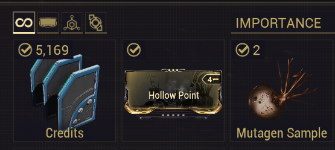

# Python screenshot project

This little project is me learning more about python through the usage of library's and taking input directly from the screen to transfer somewhere else. 
 
This project has helped a lot in learning about importing and downloading library's as well as how it depth python truly is.
 
This will hopefully be the first of many little projects I do to learn python with much more interactivity. 

# How it works

This project uses a game I play often called Warframe(https://www.warframe.com) and if you are familar with the game you will understand mods and the trading scene within the game.
 
If you are not familar a quick TL:DR is mods are items within the game that power up the character and you can sell them to other players in exchange for the in game currency/other items.
 
What this piece of code does is takes a screenshot of a certain area of the page where a mod most likely will be placed (a certain mission allows you to get one mod and it will be placed in the same spot on the screen everytime). The mod is the item in gold (in this example Hollow Point)

 
After taking the screenshot the code will read the image for any words it can see and output it to the console.

 
Finally it will open up the internet in this case chrome and whatever words it got from reading the screenshotted image it will place it within the search bar of the warframe trading website (warframe.market) and click enter.

 
This mini project came to be about being a time save, all be it a little one but stops me having to type out these mods everytime and open the website, all I have to do now is run the code and let it self input everything I need.
 
Also worth mentioning this is not intended to hack the game or gain an unfair advantage in the game- it is merely a personal timesave and I have no affiliation with warframe or warframe.market. All rights and properties are theirs and if asked to I will amend this piece of code to not mention them directly. 

